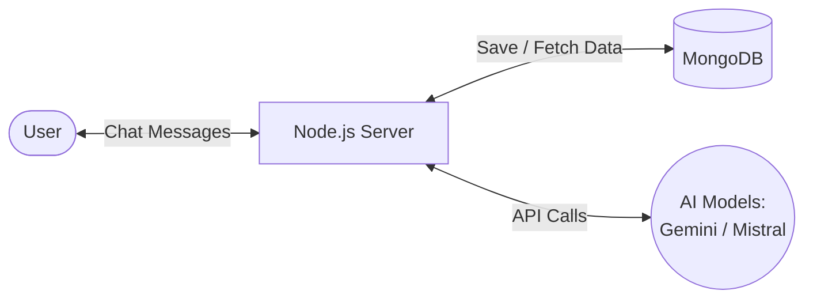
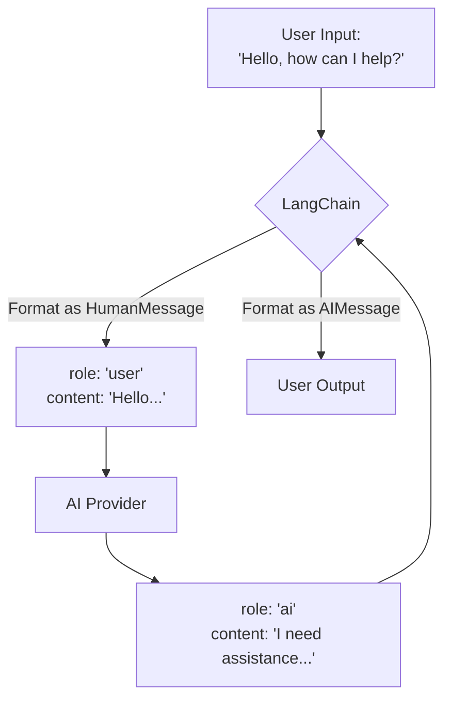
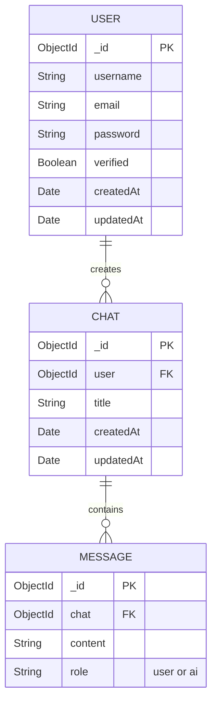
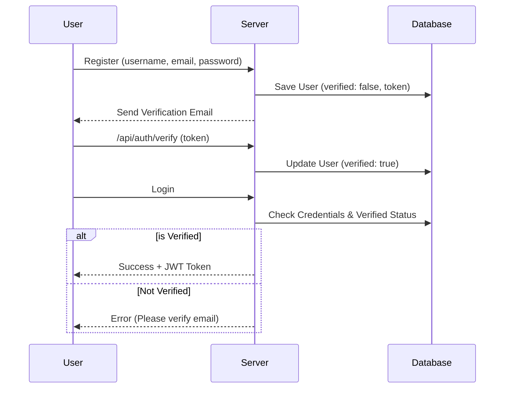

# QueryDesk - Intelligent AI Agents Platform

QueryDesk is a modern, full-stack application that empowers users to create, deploy, and interact with autonomous AI agents. The platform integrates powerful Large Language Models (LLMs) with custom system prompts, real-time web searching, and a polished user interface.

##  Features at a Glance

- **Multi-Model Support:** Harness the power of both **Google Gemini** and **Mistral AI** depending on the task's requirements.
- **AI Seller Agent Generator:** Users can create custom "Seller Agents" that act as AI representatives to answer product questions and handle price negotiations dynamically.
- **Tavily Web Search Tool:** Agents are equipped with the Tavily API, allowing them to search the internet and provide up-to-date answers natively.
- **Real-Time Chat:** Built with **Socket.io** to provide an instant, seamless conversational experience between users and the AI.
- **Secure Authentication:** JWT-based authentication combined with Nodemailer for secure email verification.
- **Modern Architecture:** A clear separation of concerns with a React/Vite frontend and a Node/Express backend powered by MongoDB.

---

##  Architecture & Technologies

The application is split into a modular full-stack architecture:

### Frontend (Client-Side)
- **React (Vite):** Blazing fast build tool and development server for an optimal React experience.
- **Redux Toolkit:** Used for global state management (managing User Auth and Chat states).
- **React Router:** For secure and seamless navigation, including protected routes.
- **Axios:** Handles asynchronous API requests with robust interceptors and cross-origin credential sharing.
- **React Markdown & Remark GFM:** To beautifully render the markdown responses returned by the AI.
- **CSS Variables:** A highly responsive, glassmorphic UI driven purely by vanilla CSS and CSS custom properties (Variables), ensuring lightweight styling and dynamic dark modes.

### Backend (Server-Side)
- **Node.js & Express:** Lightweight, fast, and scalable server infrastructure.
- **MongoDB & Mongoose:** NoSQL database handling complex schemas for Users, Chats, Messages, and Custom Agents.
- **LangChain:** The core framework orchestrating the AI logic. It handles standardizing message formats (`SystemMessage`, `HumanMessage`, `AIMessage`), tool binding, and LLM invocation.
- **Socket.io:** Handles bi-directional communication to stream the AI's generation process back to the user in real-time.
- **JWT & bcryptjs:** Strong hashing for passwords and stateless, secure JWT cookies for session management (`SameSite=None` configured for cross-origin hosting).

---

##  AI Integration Deep Dive

QueryDesk doesn't just call an API; it leverages **LangChain** to create a sophisticated reasoning loop:

### The Models
- **Google Gemini Pro:** Used for complex reasoning and deep conversations.
- **Mistral AI:** Available as an alternative open-weight LLM for rapid inference.

### Tool Binding & Tavily Search
The LLM is initialized and bound to specific external tools. The primary tool is the **Tavily Search Engine**. 
If a user asks a question requiring current world knowledge, the LLM will pause generation, decide to invoke the `searchInternetTool`, parse the JSON response from Tavily, and synthesize a final answer. 

### System vs. Human Messages
- **HumanMessage:** The raw input provided by the user in the chat interface.
- **SystemMessage:** The invisible set of instructions that governs how the AI behaves. In QueryDesk, the System Message is dynamically generated (especially for the Seller Agent) to dictate negotiation tactics, hidden bottom-line prices, and behavioral constraints.

---

## Database Schemas

The database leverages three core pillars plus one dynamic agent structure:

1. **User Schema:** Stores encrypted passwords, usernames, JWT tokens, and an `isVerified` flag tied to an email OTP for secure onboarding.
2. **Chat Schema:** Acts as the container for a conversation thread. It links a specific `User` to a list of `Messages`.
3. **Message Schema:** Stores individual chat bubbles. It differentiates between `role: "user"` and `role: "ai"`, timestamping each interaction.
4. **Seller Agent Schema:** A specialized schema that stores product data (price, condition, accessories), negotiation constraints (max discount, minimum acceptable price), and a generated unique `slug` for public-facing URLs.

---

## The Seller Agent System

A flagship feature of QueryDesk is the **Seller Agent System**. 

1. **Creation:** A user fills out a comprehensive form detailing a product they wish to sell, including a "Selling Price" and a hidden "Minimum Acceptable Price".
2. **Prompt Generation:** The backend dynamically compiles this data into a highly strict **System Message**. The prompt explicitly instructs the AI to never reveal the minimum price and to negotiate based on chosen styles (Aggressive, Balanced, Flexible).
3. **Public Deployment:** The backend generates a unique `slug` (e.g., `/agent/1a2b3c4d`). Anyone with the link can visit the public page.
4. **Interaction:** Buyers chat with the AI. The AI utilizes the generated System Prompt to haggle, answer product questions, and capture buyer contact information once a deal is struck.

---

## Security & Email Verification

- **Nodemailer:** When a user registers, a unique OTP (One Time Password) is generated and emailed using Nodemailer. The user cannot log in until the OTP is verified.
- **Cross-Origin Resource Sharing (CORS):** The backend is strictly configured to only accept requests from the deployed Vercel frontend, utilizing `Secure` and `SameSite=None` cookies to maintain sessions across domains.
- **Ghost Data Prevention:** When a user deletes their account, a cascading deletion sequence is triggered, wiping all associated Chats, Messages, and Agents from the database to comply with modern data privacy standards.

---

## Deployment

QueryDesk is designed to be deployed across multiple cloud providers:
- **Frontend:** Deployed globally on the **Vercel** Edge Network. A `vercel.json` file is utilized to handle SPA routing rules.
- **Backend:** Hosted on **Render**, providing a persistent Node environment for Socket.io connections.
- **Database:** Hosted on **MongoDB Atlas**, serving as the central nervous system for the platform.
